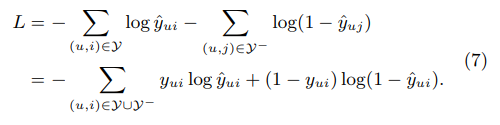

# DLForMovieRecommend

2019/1/18
1. 把NFM修改一下，用来排序，数据集也相应修改，代码能训练模型，但是loss没有优化的痕迹，有时候会出现nan
深度学习模型参数如果初始化太小，则信号会不断缩小，很难产生作用；如果初始化太大，则信号会不断增大溢出，而起不到作用
## nan问题解决了，是tf.log（x），x传入0或负值导致的！ 使用tf.clip_by_value()
http://blog.sina.com.cn/s/blog_6ca0f5eb0102wr4j.html

2019/1/21
2. loss函数为负数，且不断向负无穷逼近
self.out = tf.sigmoid(self.out_train - self.out_nega)  
self.loss = tf.losses.compute_weighted_loss(tf.log(tf.clip_by_value(self.out, 1e-8, 1.0)))  

改为 ->  
self.loss = tf.losses.compute_weighted_loss(self.out)
或  ->  
self.loss = tf.losses.compute_weighted_loss(-tf.log(tf.clip_by_value(self.out, 1e-8, 1.0)))

3. topN推荐太慢了  
  
1) 每个用户并行处理推荐  
2) 物品提前筛选, 通过简单的算法过滤掉一些不太可能会推荐的电影  
  
  
  
2019/1/22  
4. 回到第一个问题,nan问题是用一个函数:tf.clip_by_value() 解决了,但是呢训练的时候会一直在一个值上下波动,  
这篇文章也提到了这个问题:  
http://blog.sina.com.cn/s/blog_6ca0f5eb0102wr4j.html  
问题的原因可能是:单纯的cut上下界值会影响优化,   
解决的办法是:考虑神经网络每层的值域, 通过激励函数:sigmoid, 初始化的参数也可能要考虑进去.  
进过修改后的神经网络终于朝着loss函数减小的方向前进了  
  
最后的loss函数:  
  

5.嗯,朝着loss函数增大方向了!  
loss定义:  
self.positive = -tf.log(self.last_pair_out)  
self.negative = -tf.log(1-self.out)  
self.loss = tf.reduce_sum(self.positive + self.negative)  
  
原来的模型输入是这样子的, 如下  
self.train_features = tf.placeholder(tf.int32, shape=[2, None, None], name='featureV')  
self.last_pair_out = tf.placeholder(tf.float32, shape=[None, 1], name='lastPairOut')  
  
然后在训练的时候,先喂正样本的数据  
out = self.sess.run(self.out, feed_dict=feed_dict)
feed_dict[self.last_pair_out] = out  
然后在喂负样本:
这样子训练是会让loss函数一直增大的!  
从书上大致了解到,神经网络在训练的时候是用梯度下降的!,具体是计算从损失函数到每个可变参数(Viariable)的梯度,然后乘以一个学习率,然后相减.
在这里,self.positive, 实际上可以看做是一个常数, 所以损失函数实际只有负样本起作用, self.negative减小的同时, self.positive会增大!,所以总的损失函数增大是有可能的!  
解决办法是: 用placeholder把正负样本都加进去, 产生两个输入流, 最后汇聚在损失函数  
过程中可能覆盖了变量, 相同变量被重复赋值(因为有两个输入流),结果上是朝正确方向的  
```
Epoch 1 [18.0 s]	train=5354.8681 [0.0 s]  
Epoch 2 [17.7 s]	train=5350.6970 [0.0 s]  
Epoch 3 [17.7 s]	train=5350.1972 [0.0 s]  
Epoch 4 [17.5 s]	train=5349.6855 [0.0 s]  
Epoch 5 [17.7 s]	train=5346.7460 [0.0 s]  
Epoch 6 [18.1 s]	train=4520.9783 [0.0 s]  
Epoch 7 [18.8 s]	train=3497.4401 [0.0 s]  
Epoch 8 [18.8 s]	train=3295.0038 [0.0 s]  
Epoch 9 [18.2 s]	train=3173.6831 [0.0 s]  
Epoch 10 [18.1 s]	train=3077.8043 [0.0 s]  
Epoch 11 [18.0 s]	train=2981.6315 [0.0 s]  
Epoch 12 [18.0 s]	train=2901.3917 [0.0 s]  
Epoch 13 [18.0 s]	train=2831.0834 [0.0 s]  
Epoch 14 [18.2 s]	train=2775.1349 [0.0 s]  
Epoch 15 [18.0 s]	train=2729.9486 [0.0 s]  
Epoch 16 [17.7 s]	train=2694.1759 [0.0 s]  
Epoch 17 [18.0 s]	train=2654.7019 [0.0 s]  
Epoch 18 [18.2 s]	train=2632.2117 [0.0 s]  
Epoch 19 [18.0 s]	train=2605.1232 [0.0 s]  
Epoch 20 [18.1 s]	train=2575.8986 [0.0 s]  
Epoch 21 [18.6 s]	train=2556.0981 [0.0 s]  
Epoch 22 [17.6 s]	train=2537.3208 [0.0 s]  
Epoch 23 [18.5 s]	train=2525.1528 [0.0 s]  
Epoch 24 [18.0 s]	train=2512.0661 [0.0 s]  
Epoch 25 [18.0 s]	train=2498.1805 [0.0 s]  
```  
2019/1/23  
6.训练大约200轮后,loss收敛了, 但是HR指标不理想, 每个用户推荐10个电影, 总共只有277次命中  
HR=0.023  
这个结果显然是不理想的!也就比随机好点  
后面应该怎么寻找问题呢?  

2019/1/24  
发现了一个问题, 推荐列表里面有训练集的item, 去掉后,   
HR=0.043, 差不多翻倍了  
如果不训练的话: HR%10=0.0025  
下一步考虑模型的调参吧  
没有神经网络的话loss大概在1950收敛:  
```
hit: 497  
HR%10: 0.04114919688690181  
MAP%10: 0.023411417271102675  
NDCG%10: 0.008022221873267291  
```  
  
两层的话, 大约在1900收敛, HR=0.045  
  
  
感觉这样很奇怪啊, 模型肯定有哪里不对  
HR应该至少0.15才对  
最简单的协同过滤最起码是0.15  
  1/26 ~ 2/16  
  过年咯~
  
2019/2/17    
检查代码的时候发现一个很严重的bug  
userID和movieID同号时会认为是同一个特征  
特征数目也设置为用户数  
这是很严重的bug  
数据处理就出现问题, 后面学习出来的东西肯定一团糟的  
出现bug主要原因是在源代码基础上大幅度修改, 有些代码块含义也不是很明白  
后期打算再看一遍LoadData的代码  
今天开始把数据集换为ml-100K, 训练速度大幅度提升  
数据集修改格式真麻烦, 主要是不想修改源代码处理  
数据集中的movieID特征和movieID真实值起始位的错误  
